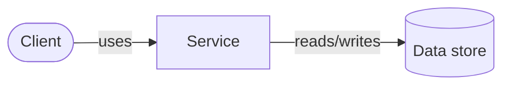

# Architecture Diagrams

Architecture diagrams are maps, not inventories. Their job is to answer one
architecture question for one audience without making the reader reconstruct
the system from implementation detail. Mermaid source belongs beside the
architecture it describes so review can keep it accurate.

This chapter covers system-context and container-overview diagrams only. Use
sequence, state, and data-flow diagrams for their own questions rather than
combining them with an architecture overview. Mermaid fences are part of the
house Markdown dialect; see [`../wiki/07-markdown-flavor.md`](../wiki/07-markdown-flavor.md).

## Choose the view *(default)*

1. One diagram answers one stated question for one named audience. Put the
   diagram level and audience beneath its title, for example: `Container
   overview for operators and contributors`.
2. Use **system context** to show people, the system, external systems, and
   meaningful trust or ownership boundaries. Do not show services, databases,
   ports, or implementation modules there.
3. Use **container overview** to show deployable applications, data stores,
   and their meaningful relationships inside one system boundary. Do not show
   endpoints, tables, classes, functions, or individual configuration values.
4. Use a separate lower-level diagram when those details are needed. A diagram
   that answers deployment, data flow, and service ownership at once is split,
   not made denser.

The level is a contract with the reader: peer nodes represent peer concepts.
Mixing an API endpoint with a service, or a database table with a host, breaks
that contract and makes the diagram misleading.

## Compose for reading *(default)*

1. State the purpose, audience, and meaningful exclusions in prose immediately
   around the diagram.
2. Use one dominant direction (`LR` or `TD`). Arrange nodes to follow the
   primary request, data, or control path and avoid crossed edges. Split the
   diagram when a clean direction is no longer possible.
3. Treat 15 to 20 nodes as a review threshold, not a quota. A smaller diagram
   with dense crossings is also split; a larger diagram is acceptable only when
   its structure remains immediately scannable.
4. Use boundaries only for a real ownership, trust, network, or deployment
   scope. Do not add boxes solely for decoration.
5. Label every relationship whose meaning is not obvious from the two nodes.
   Use a short verb, such as `proxies`, `reads/writes`, or `publishes`; add a
   protocol only when it changes understanding. Do not repeat boilerplate
   labels that add no meaning.
6. Add a legend or nearby note when a shape, line style, or color has a meaning
   the reader cannot infer.

## Visual vocabulary *(default)*

Within one diagram, use the same Mermaid form and label pattern for equivalent
concepts:

| Concept | Default representation |
|---|---|
| Person or client | rounded node |
| Host or system peer | rectangle with a two-line `name` / `role` label |
| Service or deployable application | rectangle |
| Data store or durable storage | cylinder |
| External system | rectangle outside the local boundary, labelled external when needed |
| Ownership, trust, network, or host scope | `subgraph` boundary |

Use short, reader-facing labels. Implementation names, image tags, IP
addresses, host ports, endpoint paths, and individual tables belong in a
lower-level diagram or adjacent reference text unless they are the point of
this view. Mermaid C4 syntax may be used where the target renderer supports
it, but ordinary flowcharts remain the portable default because Mermaid's C4
support is experimental.

## Rendered hierarchy and flow *(default)*

1. Peer concepts must look like peers in the rendered output. They use the
   same shape, label pattern, border treatment, and visual weight. For example,
   two server hosts use the same two-line host label even when one is always on
   and the other is on demand.
2. Do not rely on Mermaid `subgraph` dimensions to communicate peer status.
   Their size follows their contents and can falsely imply hierarchy. In a
   host-level view, show hosts as same-shaped nodes; reserve host boundaries for
   a container view where their contents are the subject.
3. Declare one primary path. Its nodes must render on one horizontal or vertical
   lane in the chosen direction. Secondary clients, checks, and control paths
   branch from that lane without moving, wrapping around, or visually competing
   with it.
4. A view uses one granularity. It may show named hosts, individual containers,
   or grouped service tiers, but it does not show those categories as peers.
   When named products and anonymous groups are both useful, create separate
   diagrams or normalize both to the same group level.
5. Keep distinct concerns separate. DNS and certificate control, request
   routing, LAN topology, boot unlock, data flow, and operator administration
   are separate diagrams unless their interaction is the stated question.
6. Review the rendered result, not only the Mermaid source. Reject a diagram
   when peer elements differ in visual prominence, the primary lane bends,
   secondary paths dominate it, labels wrap into unclear blocks, or a boundary
   creates more whitespace than meaning.

## Architecture overview as a diagram set *(default)*

An architecture overview is a linked set of small diagrams when one view cannot
answer its question without mixing levels. The overview document names the
purpose and scope of each view and links readers from the broad map to the
relevant detail.

1. Start with a **system landscape**: people or clients, peer hosts or systems,
   external dependencies, and the primary relationships between them. This is
   the navigation map; it does not list containers.
2. Add a **runtime placement** view when readers need to know where services
   run. Use a fixed-column placement matrix: equal host headers form the
   columns and their service groups fill the cells beneath. Do not encode
   ownership with flowchart arrows or unequal `subgraph` sizes, because those
   layout constraints falsely imply hierarchy.
3. Add a **management and delivery** view when source control, infrastructure
   as code, deployment tooling, or operator machines are material to operating
   the system. It shows repositories, control nodes, and managed targets, not
   application request routing.
4. Add a **request path** view when ingress, authentication, security controls,
   or proxy routing need explanation. Its primary lane follows the request from
   client to target; direct and proxied destinations branch after the relevant
   control point.
5. Keep each diagram independently useful. A reader can understand any one
   without studying the others, while links and stable host/service names make
   the set navigable as a whole.

## Placement matrices *(default)*

1. Use a Mermaid `block` diagram with explicit column count for runtime service
   placement when the project renderer supports it. Equal host peers occupy
   equal columns; grouped services belong below their host header. Confirm the
   exact declaration in the active project renderer; vendored source text or a
   newer upstream Mermaid release is not evidence that the active parser
   supports it.
2. A placement matrix expresses ownership only. It contains no request, proxy,
   data, or control-flow arrows; those relationships belong in their dedicated
   views.
3. Keep a service group in one cell. List the representative services needed to
   orient a reader, then link to the service catalogue for the complete
   inventory.
4. If the target renderer lacks Mermaid `block` support, use a Markdown table
   with one column per host. Do not substitute an auto-laid-out flowchart.

## Security and accessibility *(default)*

1. Diagrams about public ingress, network topology, deployment, or threat
   boundaries show the relevant trust boundary, TLS termination, authentication
   point, and externally reachable path. A pure product context diagram need
   not pretend to be a threat model.
2. Add Mermaid `accTitle` and `accDescr` when the renderer supports them. The
   surrounding prose remains the accessible explanation and must stand on its
   own when Mermaid renders as a code block.
3. Do not rely on color alone to convey meaning. Shape, boundary, label, or
   line style must also distinguish categories.

## Maintenance and review *(default)*

1. Keep the Mermaid source in the repository with the architecture it depicts.
   Update the diagram in the same change as an affected boundary, interface,
   service placement, or externally reachable path, or state in the change
   review why the diagram remains accurate.
2. Before accepting a diagram, verify that every node matches the declared
   level, peer concepts use the same vocabulary, each non-obvious edge is
   labelled, and the stated purpose can be answered without zooming into
   implementation names.
3. Confirm that the source renders in the project's documented Mermaid-capable
   viewer. If a renderer lacks Mermaid support, the fenced source and nearby
   prose remain the fallback.

## Minimal authoring template *(pattern)*

````markdown
## <Diagram title>

**Level and audience:** <system context or container overview; audience>.
**Purpose:** <one question this diagram answers>.
**Scope:** Includes <...>. Omits <...>.


````
